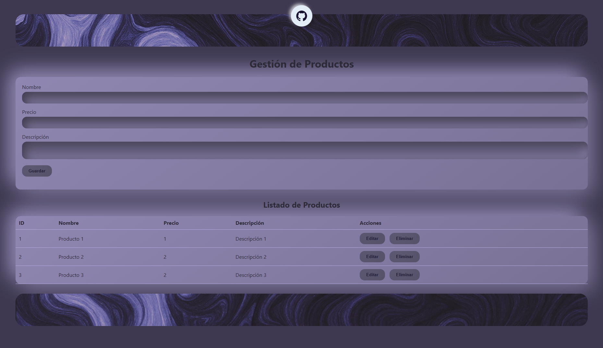

# CRUD Neuromórfico


Un sistema CRUD (Crear, Leer, Actualizar, Eliminar) diseñado con una base de datos de inspiración neuromórfica o que gestiona datos relacionados con sistemas neuromórficos. Este proyecto demuestra la implementación de operaciones básicas de gestión de datos a través de una interfaz de usuario.

---

## Tabla de Contenidos

- [Acerca del Proyecto](#acerca-del-proyecto)
- [Características](#características)
- [Objetivo](#objetivo)
- [Tecnologías Usadas](#tecnologías-usadas)
- [Primeros Pasos](#primeros-pasos)
  - [Prerequisitos](#prerequisitos)
  - [Instalación](#instalación)
- [Uso](#uso)
- [Creadores](#creadores)
- [Captura del proyecto](#captura-del-proyecto)
- [Agradecimientos](#agradecimientos)

---

## Acerca del Proyecto

Este proyecto tiene como objetivo proporcionar una infraestructura básica para la gestión de datos de una entidad específica. En un contexto que sugiere una arquitectura o inspiración neuromórfica. Se implementa un backend en python para realizar operaciones CRUD sobre los datos que se almacenan, permitiendo la interacción con el sistema a través de solicitudes HTTP. 

El uso de un framework web como Flask facilita la rápida prototipación y el despliegue de la página web.

---

## Características

- **Base de Datos Persistente:** Almacenamiento de datos mediante una base de datos relacional.

- **Validación de Datos:** Asegura la integridad de los datos de entrada.

- **Entorno de Desarrollo Fácil:** Configuración sencilla para empezar a trabajar.

---
## Objetivo
El objetivo general de este proyecto es crear un sistema CRUD (Crear, Leer, Actualizar, Eliminar) con una base de datos inspirada en sistemas neuromórficos, o que gestiona datos relacionados con ellos. Este sistema permite la gestión básica de datos a través de una interfaz de usuario, con un backend desarrollado en Python utilizando un framework web como Flask para interactuar con los datos almacenados mediante solicitudes HTTP.

---

## Tecnologías Usadas

* **Python 3.x:** Lenguaje de programación principal.
* **JavaScript:** Lenguaje de programación para las funciones.
* **Flask:** Microframework web para la construcción de la página web.

* **`SQLite3`:** Base de datos por defecto para desarrollo (ligera y no requiere configuración adicional).


---

## Primeros Pasos

Con estas instrucciones se puede configurar el proyecto en la máquina local para desarrollo y pruebas.

### Prerequisitos

Antes de empezar, hay que asegurarse de tener instalado lo siguiente:

* **Python 3.x:** Se puede obtener desde [python.org](https://www.python.org/downloads/).
* **pip:** El gestor de paquetes de Python (generalmente viene con Python).

### Instalación

1.  **Clonar el repositorio:**
    ```bash
    git clone https://github.com/S-mazo/WEBPAGE-CRUD
    cd CRUD-neuromorfico
    ```

2.  **Crear un entorno virtual (recomendado):**
    ```bash
    python -m venv venv
    ```

3.  **Activar el entorno virtual:**
    * **En Windows:**
        ```bash
        .\venv\Scripts\activate
        ```
    * **En macOS/Linux:**
        ```bash
        source venv/bin/activate
        ```

4.  **Instalar las dependencias:**
    ```bash
    pip install flask
    ```

---


## Uso

Para iniciar la aplicación Flask:
* Ejecutar el archivo `backend.py`

```bash
python backend.py
```

Esto iniciará el servidor en modo desarrollo. Luego, en el navegador se accede a [http://localhost:5000](http://localhost:5000) para interactuar con la interfaz web del CRUD.


---
## Creadores
 - **Samuel Mazo Echeverri** <br> smazo@unilasallista.edu.co <br> [](https://github.com/S-mazo)
 - **Santiago Silva Carvajal** <br> ssilva7@unilasallista.edu.co <br> [](https://github.com/rokuritas)

---
## Captura del proyecto

Enlace del Proyecto: [https://github.com/S-mazo/WEBPAGE-CRUD](https://github.com/S-mazo/WEBPAGE-CRUD)

---

## Agradecimientos

* [Flask](https://flask.palletsprojects.com/)
* [Uiverse.io](https://uiverse.io/)
* [Sora](https://sora.chatgpt.com/)
* [ChatGPT](https://chat.openai.com/)
* [Copilot](https://copilot.github.com/)
* [Gemini](https://gemini.com/)
* [Blackbox](https://blackbox.ai/)
* [Bootstrap](https://getbootstrap.com/)
* [Codesnap plus 📸](https://marketplace.visualstudio.com/items?itemName=huibizhang.codesnap-plus)
* [Neuromorphism](https://neumorphism.io/)
---